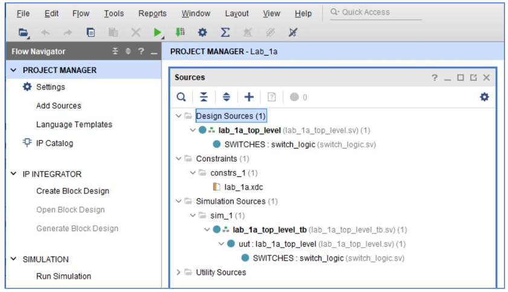

## Posting Vivado Project to Github

### 1. Create your project folder in the following structure

```
PROJECT_NAME/
├── .git/
├── .gitignore
├── project_name.tcl # Vivado project generator script
├── rtl/ # rtl code (design files)
│ └── *.sv
├── testbenches/ # simulation files
│ └── *.sv
├── IP/ # Tracked project-specific IP repository
│ ├── my_first_ip/
│ │  ├── src/
│ │  ├── xgui/
│ │  └── component.xml
│ ├── my_second_ip/
│ └── ...
├── project_name/ # Vivado generated files (NOT tracked)
│ ├── project_name.xpr
│ ├── project_name.cache/
│ ├── project_name.hw/
│ ├── project_name.ip_user_files/
│ ├── project_name.sim/
│ └── project_name.runs/
└── README.md
```

### 2. In Vivado, add all source files in Project Manager

- add design sources (`.sv`, `.vhd`)
- add simulation sources
- add constraints (`.xdc`)
- add any IP cores needed from IP catalog
- etc

Like the following:

<p align="center">
  <a href="../images/vivado_project_manager.png">
    
  </a>
</p>

### 3. Generate the Vivado TCL script

- In Vivado:  
  **File $\rightarrow$ Project $\rightarrow$ Write TCL**
- Save the script as `project_name.tcl` in the repository root

### 4. Commit and Push

```bash
git init
git add .
git commit -m "Initial FPGA project"
git branch -M main
git remote add origin <repository-url>
git push -u origin main
```
